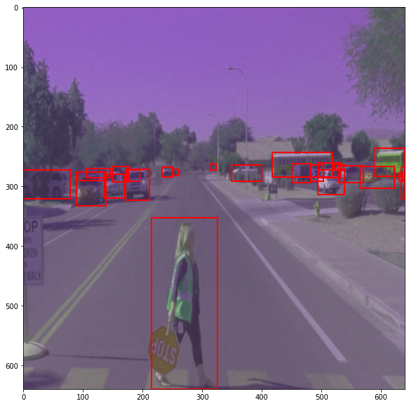

# Object Detection in an Urban Environment

## Data
python inference_video.py --labelmap_path label_map.pbtxt --model_path experiments/reference/exported/saved_model --tf_record_path data/test/segment-12200383401366682847_2552_140_2572_140_with_camera_labels.tfrecord --config_path experiments/reference/pipeline_new.config --output_path animation.gif

For this project, we will be using data from the [Waymo Open dataset](https://waymo.com/open/).

[OPTIONAL] - The files can be downloaded directly from the website as tar files or from the [Google Cloud Bucket](https://console.cloud.google.com/storage/browser/waymo_open_dataset_v_1_2_0_individual_files/) as individual tf records. We have already provided the data required to finish this project in the workspace, so you don't need to download it separately.

## Structure

### Data

The data you will use for training, validation and testing is organized as follow:
```
/home/workspace/data/waymo
	- training_and_validation - contains 97 files to train and validate your models
    - train: contain the train data (empty to start)
    - val: contain the val data (empty to start)
    - test - contains 3 files to test your model and create inference videos
```
The `training_and_validation` folder contains file that have been downsampled: we have selected one every 10 frames from 10 fps videos. The `testing` folder contains frames from the 10 fps video without downsampling.

You will split this `training_and_validation` data into `train`, and `val` sets by completing and executing the `create_splits.py` file.


### Experiments
The experiments folder will be organized as follow:
```
experiments/
    - pretrained_model/
    - exporter_main_v2.py - to create an inference model
    - model_main_tf2.py - to launch training
    - reference/ - reference training with the unchanged config file
    - experiment0/ - create a new folder for each experiment you run
    - experiment1/ - create a new folder for each experiment you run
    - experiment2/ - create a new folder for each experiment you run
    - label_map.pbtxt
    ...
```

## Prerequisites

### Local Setup

For local setup if you have your own Nvidia GPU, you can use the provided Dockerfile and requirements in the [build directory](./build).

Follow [the README therein](./build/README.md) to create a docker container and install all prerequisites.

### Download and process the data

**Note:** ”If you are using the classroom workspace, we have already completed the steps in the section for you. You can find the downloaded and processed files within the `/home/workspace/data/preprocessed_data/` directory. Check this out then proceed to the **Exploratory Data Analysis** part.

The first goal of this project is to download the data from the Waymo's Google Cloud bucket to your local machine. For this project, we only need a subset of the data provided (for example, we do not need to use the Lidar data). Therefore, we are going to download and trim immediately each file. In `download_process.py`, you can view the `create_tf_example` function, which will perform this processing. This function takes the components of a Waymo Tf record and saves them in the Tf Object Detection api format. An example of such function is described [here](https://tensorflow-object-detection-api-tutorial.readthedocs.io/en/latest/training.html#create-tensorflow-records). We are already providing the `label_map.pbtxt` file.

You can run the script using the following command:
```
python download_process.py --data_dir {processed_file_location} --size {number of files you want to download}
```

You are downloading 100 files (unless you changed the `size` parameter) so be patient! Once the script is done, you can look inside your `data_dir` folder to see if the files have been downloaded and processed correctly.

### Classroom Workspace

In the classroom workspace, every library and package should already be installed in your environment. You will NOT need to make use of `gcloud` to download the images.

## Instructions

### Exploratory Data Analysis

You should use the data already present in `/home/workspace/data/waymo` directory to explore the dataset! This is the most important task of any machine learning project. To do so, open the `Exploratory Data Analysis` notebook. In this notebook, your first task will be to implement a `display_instances` function to display images and annotations using `matplotlib`. This should be very similar to the function you created during the course. Once you are done, feel free to spend more time exploring the data and report your findings. Report anything relevant about the dataset in the writeup.

Keep in mind that you should refer to this analysis to create the different spits (training, testing and validation).


### Create the training - validation splits
In the class, we talked about cross-validation and the importance of creating meaningful training and validation splits. For this project, you will have to create your own training and validation sets using the files located in `/home/workspace/data/waymo`. The `split` function in the `create_splits.py` file does the following:
* create three subfolders: `/home/workspace/data/train/`, `/home/workspace/data/val/`, and `/home/workspace/data/test/`
* split the tf records files between these three folders by symbolically linking the files from `/home/workspace/data/waymo/` to `/home/workspace/data/train/`, `/home/workspace/data/val/`, and `/home/workspace/data/test/`

Use the following command to run the script once your function is implemented:
```
python create_splits.py --data-dir /home/workspace/data
```

### Edit the config file

Now you are ready for training. As we explain during the course, the Tf Object Detection API relies on **config files**. The config that we will use for this project is `pipeline.config`, which is the config for a SSD Resnet 50 640x640 model. You can learn more about the Single Shot Detector [here](https://arxiv.org/pdf/1512.02325.pdf).

First, let's download the [pretrained model](http://download.tensorflow.org/models/object_detection/tf2/20200711/ssd_resnet50_v1_fpn_640x640_coco17_tpu-8.tar.gz) and move it to `/home/workspace/experiments/pretrained_model/`.

We need to edit the config files to change the location of the training and validation files, as well as the location of the label_map file, pretrained weights. We also need to adjust the batch size. To do so, run the following:
```
python edit_config.py --train_dir /home/workspace/data/train/ --eval_dir /home/workspace/data/val/ --batch_size 2 --checkpoint /home/workspace/experiments/pretrained_model/ssd_resnet50_v1_fpn_640x640_coco17_tpu-8/checkpoint/ckpt-0 --label_map /home/workspace/experiments/label_map.pbtxt
```
A new config file has been created, `pipeline_new.config`.

### Training

You will now launch your very first experiment with the Tensorflow object detection API. Move the `pipeline_new.config` to the `/home/workspace/experiments/reference` folder. Now launch the training process:
* a training process:
```
python experiments/model_main_tf2.py --model_dir=experiments/reference/ --pipeline_config_path=experiments/reference/pipeline_new.config
```
Once the training is finished, launch the evaluation process:
* an evaluation process:
```
python experiments/model_main_tf2.py --model_dir=experiments/reference/ --pipeline_config_path=experiments/reference/pipeline_new.config --checkpoint_dir=experiments/reference/
```

**Note**: Both processes will display some Tensorflow warnings, which can be ignored. You may have to kill the evaluation script manually using
`CTRL+C`.

To monitor the training, you can launch a tensorboard instance by running `python -m tensorboard.main --logdir experiments/reference/`. You will report your findings in the writeup.

### Improve the performances

Most likely, this initial experiment did not yield optimal results. However, you can make multiple changes to the config file to improve this model. One obvious change consists in improving the data augmentation strategy. The [`preprocessor.proto`](https://github.com/tensorflow/models/blob/master/research/object_detection/protos/preprocessor.proto) file contains the different data augmentation method available in the Tf Object Detection API. To help you visualize these augmentations, we are providing a notebook: `Explore augmentations.ipynb`. Using this notebook, try different data augmentation combinations and select the one you think is optimal for our dataset. Justify your choices in the writeup.

Keep in mind that the following are also available:
* experiment with the optimizer: type of optimizer, learning rate, scheduler etc
* experiment with the architecture. The Tf Object Detection API [model zoo](https://github.com/tensorflow/models/blob/master/research/object_detection/g3doc/tf2_detection_zoo.md) offers many architectures. Keep in mind that the `pipeline.config` file is unique for each architecture and you will have to edit it.

**Important:** If you are working on the workspace, your storage is limited. You may to delete the checkpoints files after each experiment. You should however keep the `tf.events` files located in the `train` and `eval` folder of your experiments. You can also keep the `saved_model` folder to create your videos.


### Creating an animation
#### Export the trained model
Modify the arguments of the following function to adjust it to your models:

```
python experiments/exporter_main_v2.py --input_type image_tensor --pipeline_config_path experiments/reference/pipeline_new.config --trained_checkpoint_dir experiments/reference/ --output_directory experiments/reference/exported/
```

This should create a new folder `experiments/reference/exported/saved_model`. You can read more about the Tensorflow SavedModel format [here](https://www.tensorflow.org/guide/saved_model).

Finally, you can create a video of your model's inferences for any tf record file. To do so, run the following command (modify it to your files):
```
python inference_video.py --labelmap_path label_map.pbtxt --model_path experiments/reference/exported/saved_model --tf_record_path /data/waymo/testing/segment-12200383401366682847_2552_140_2572_140_with_camera_labels.tfrecord --config_path experiments/reference/pipeline_new.config --output_path animation.gif
```

## Submission Template

### Project overview
In this project, we are using deep learning to try and detects objects in scenes, such as cars, pedestrians, and cyclists. Object detection allows the vehicle to actually perceive and understand what its sensors are detecting in the environment. This is necessary - over just base detection - because this information is often used to make decisions on how to navigate through an environment. It also provides information on object size and position, as well as information necessary for possible predictions.

The sensors provide rich information, but often merely using detection points from the lidar and radar are not enough. For redundancy and accuracy, camera detections must be used. This (usually) requires the ability to detect the objects using deep learning methods, due to the variety and variation within objects in a scene. This object detection feeds into basically every other system in the self driving vehicle, from lane detections, to traffic sign understanding, to collision free trajectories.

### Set up
This was created using the project workspace. Thus, every step made to make it work on that workspace should make this project work as well.

### Dataset
#### Dataset analysis
I explored the dataset using the provided Jupyter notebooks.

In this notebook, we performed an EDA (Exploratory Data Analysis) on the processed Waymo dataset (data in the processed folder). 

A function was created to display the following images:


Some additional analyses was performed to further explore the data. Some possible exploration that could be done:

0. Size of dataset
1. The distribution of classes in the dataset to determine if it is balanced.
2. Tthe distribution of classes by object area.
3. The distribution of classes by object position.
4. The distribution of aspects like brightness and other lighting conditions in the images.
5. How many difficult cases we faced in the data.
6. The frequency of different kinds of classes in images.

Below, number 1, 2, 3, and 6 are shown. They were taken from 40,000 images taken from the dataset. Shuffle was not used. In the future, performance permitting, the analysis should be performed in a more random manner.

This shows the occurences of classes in the dataset. There are a good number of representations of cars and pedestrians. However, cyclists seem to be much too low, which would limit the ODD of the vehicle to never be around cyclists.


The next plot shows the distribution of areas (x axis) to the frequency of images (y-axis). This ensures we have a good spread of size (and thus distances) for the data.


The next plot shows the heatmaps showing where the largest density of the classes are encountered in the image. We need to ensure that our performance is good, even near the extremes of the cameras. Overtraining to one area may prevent generalization of the model. It also may increase bias to detecting only certain types of objects in certain parts of the image.


Finally, the next plot shows the distribution of the number of objects classied vs the frequency of images (in log scale). It is important to train the model to handle large number of objects for given edge cases, like a bike team, as well as normal situations like heavy traffic.


#### Cross validation
In the workspace, the data was already split into a train/val/test split. If I had to do it myself, with the large amount of data we have, I would likely do a 70%/20%/10% split. The validation set is used to evaluate the training the model, while the test set is used to evaluate final model performance.

### Training
#### Reference experiment

As seen in the large losses below, the reference experiment had massive losses in the high 100s, and the recall and precision were near zero.


#### Improve on the reference

Attempts were made to improve the model using augmentations, playing with optimizer settings, and using different architectures. Due to memory constraints, many of these results were discarded. Further, at no points could the loss be decreased below ~1, and thus precision and recall suffered.

##### Augmentation Changes

The following augmentations were applied:

This augmentation randomly flips the image horizontally, which can help the model learn to recognize objects from different viewpoints. 

  data_augmentation_options {
    random_horizontal_flip {
    }
  }
  
This augmentation randomly adjusts the hue of the image, which changes the colors of the pixels.
  data_augmentation_options {
    random_adjust_hue {
    }  

  }
  
This augmentation randomly adjusts the brightness of the image, which can help the model learn to recognize objects under different lighting conditions.

  data_augmentation_options {
    random_adjust_brightness {
      max_delta: 0.2
    }
  }
  
This augmentation randomly adjusts the contrast of the image, which can help the model learn to recognize objects with different levels of detail. 
 
  data_augmentation_options {
    random_adjust_contrast {
    }
  }
  
This augmentation randomly adjusts the saturation of the image, which can help the model learn to recognize objects under different lighting conditions.

  data_augmentation_options {
    random_adjust_saturation {
    }
  }

This augmentation randomly converts the image from RGB to grayscale, which can help the model learn to recognize objects with less color information. 

  data_augmentation_options {
    random_rgb_to_gray {
    probability: 0.1
    }
  }

  data_augmentation_options {
    random_distort_color {
    }
  }
  
This augmentation randomly crops the image, which can help the model learn to recognize objects in different positions and scales.
  
  data_augmentation_options {
    random_crop_image {
      min_object_covered: 0.0
      min_aspect_ratio: 0.8
      max_aspect_ratio: 1.2
      overlap_thresh: 0.0
      clip_boxes: true
      random_coef: 0.1
    }
  }

Several example images are given below demonstrate the augmentations.  





##### Playing with Optimizer


##### Playing with Architecture

New pretrained architectures were used to try and improve performance. 

Faster R-CNN ResNet101 V1 640x640 was used, and total loss brought down considerably. However, ultimately due to RPN (Region Proposal Network) losses the precision and recall were still poor.


SSD ResNet152 V1 FPN 640x640 (RetinaNet152) was finally used as a last resort, but ultimately classification and localization loss was still too high. As can be seen in the animation, a number of false detections focused on dark areas were occurring. No matter how the augmentations were changed, these could not be eliminated.

